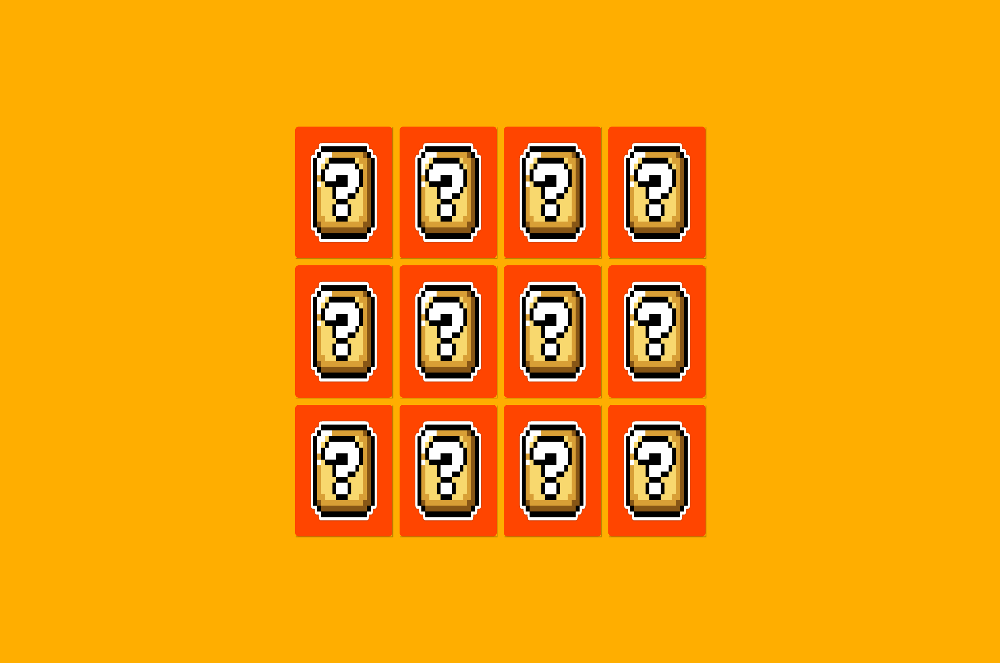

# jogo-memoria

> Projeto Jogo da Memoria do Naruto

## Tecnologias. 
- HTL
- CSS
- JS
- Git e Githaub

## Jogo
> - Ao começar o jogo ou ao atualizar a pagina sempre sera feito o embaralhamento da página
- Ao clicar em uma carta não perdera clicar nela novamente e tera que escolher outra carta
- Ao escolher outra carta a função clique sera desativada
- Sera feita a verificação se as cartas escolhidas são iguais
- Caso positivo as cartas permanecerão amostra 
- O Clique sera liberado
- Caso negativo o clique permanecerá desativado até que as cartas virem novamente
- Clique sera liberado para escolher novas cartas até acabar o jogo

[Clique aqui para acessar: ](https://andersonnazario.github.io/jogo-memoria/)